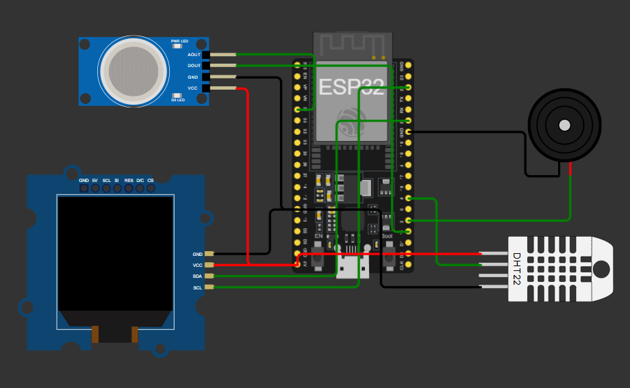
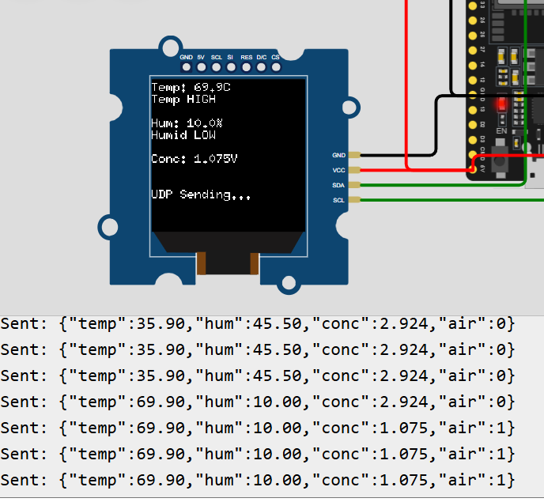
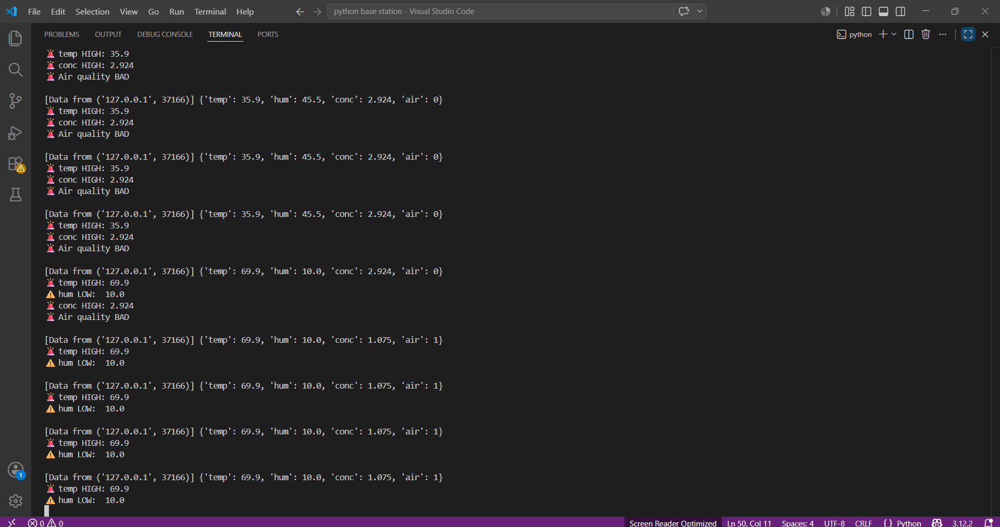

# 🌿 IoT Network Pipeline — Environmental Monitoring System

A hands-on IoT networking project built on the **ESP32 microcontroller**. Reads real-time environmental data (temperature, humidity, air quality) from DHT22 and MQ2 sensors, displays live readings on an SH1107 OLED, and streams data over **WiFi via UDP** to a Python base station server — tunneled through **playit.gg** to the public internet.

> Built as a step-by-step exploration of networking concepts — from raw UDP sockets to higher-level protocols.

---

## 📸 Demo

> Simulated on [Wokwi](https://wokwi.com) — ESP32 streams live sensor data over UDP to a Python base station via playit.gg tunnel.

### Circuit Diagram


### OLED Display Output


### Python Base Station Output


---

## 🏗️ System Architecture

```
┌─────────────────────────┐
│     Wokwi ESP32         │
│  DHT22 + MQ2 + OLED     │
│   WiFiUDP Client        │
└────────────┬────────────┘
             │ UDP Packets (JSON)
             │ WiFi → Internet
             ▼
┌─────────────────────────┐
│     playit.gg Tunnel    │
│  147.185.221.180:46069  │
│   UDP Tunnel (free)     │
└────────────┬────────────┘
             │ forwards to localhost:5000
             ▼
┌─────────────────────────┐
│  Python Base Station    │
│  UDP Server :5000       │
│  Logs CSV + Alerts      │
└─────────────────────────┘
```

---

## 🌐 Networking Concepts

This project is **Level 1** of a planned multi-level networking exploration:

| Level | Protocol | Status |
|-------|----------|--------|
| 1 | Raw UDP Sockets | ✅ Current |
| 2 | Raw TCP Sockets | 🔜 Next |
| 3 | HTTP REST API | 🔜 Planned |
| 4 | MQTT (IoT Standard) | 🔜 Planned |
| 5 | WebSocket + Dashboard | 🔜 Planned |

### Level 1 — UDP Deep Dive

| Concept | Detail |
|---------|--------|
| Protocol | UDP (User Datagram Protocol) |
| Transport Layer | Layer 4 — OSI Model |
| Connection | Connectionless — no handshake |
| Reliability | No guaranteed delivery |
| Speed | Faster than TCP |
| Packet format | JSON string in UDP datagram |
| Port | 5000 (local) → 46069 (public via tunnel) |
| Tunneling | playit.gg UDP tunnel |

**Why UDP for IoT?** Sensor data is time-sensitive. A slightly old reading is better than waiting for retransmission. UDP trades reliability for speed — perfect for continuous sensor streaming.

---

## 🧰 Hardware Components

| Component | Description | Pin |
|-----------|-------------|-----|
| ESP32 DevKit C V4 | Main microcontroller | — |
| DHT22 | Temperature & humidity sensor | GPIO4 |
| MQ2 Gas Sensor (AOUT) | Analog air quality | GPIO34 |
| MQ2 Gas Sensor (DOUT) | Digital air quality alert | GPIO15 |
| SH1107 OLED (128x128) | Live display | SDA:21, SCL:22 |
| Buzzer | Audio alert | GPIO2 |

---

## 📐 Wiring

### DHT22
| DHT22 Pin | ESP32 Pin |
|-----------|-----------|
| VCC | 5V |
| GND | GND |
| SDA | GPIO4 |

### MQ2 Gas Sensor
| MQ2 Pin | ESP32 Pin |
|---------|-----------|
| VCC | 5V |
| GND | GND |
| AOUT | GPIO34 |
| DOUT | GPIO15 |

### SH1107 OLED
| OLED Pin | ESP32 Pin |
|----------|-----------|
| VCC | 5V |
| GND | GND |
| SDA | GPIO21 |
| SCL | GPIO22 |

### Buzzer
| Buzzer Pin | ESP32 Pin |
|------------|-----------|
| + | GPIO2 |
| - | GND |

> ⚠️ ESP32 GPIO pins are **3.3V tolerant only**. Use a voltage divider on MQ2 AOUT/DOUT since the sensor runs on 5V.

---

## 🗂️ Project Structure

```
IoT-Network-Pipeline/
├── assets/
│   ├── circuit.png          # Wokwi circuit screenshot
│   ├── oled_display.png     # OLED output screenshot
│   └── server_output.png    # Python terminal screenshot
├── sketch.ino               # ESP32 Arduino sketch (UDP client)
├── base_station.py          # Python UDP server
├── diagram.json             # Wokwi circuit diagram
├── libraries.txt            # Wokwi library dependencies
├── .gitignore
├── LICENSE
└── README.md
```

---

## 📦 Dependencies

### Arduino Libraries
- `Wire` — I2C communication
- `U8g2` — OLED display driver
- `DHT sensor library` — DHT22 sensor
- `WiFi` — ESP32 built-in
- `WiFiUdp` — ESP32 built-in

### Python
- Python 3.x
- Standard library only (`socket`, `json`, `csv`, `datetime`, `os`)

---

## 🚀 Setup & Usage

### 1. Wokwi Simulation

1. Go to [wokwi.com](https://wokwi.com) → New Project → **ESP32 Arduino**
2. Paste `sketch.ino` into the editor
3. Replace `diagram.json` with the one from this repo
4. Add libraries via Library Manager: `DHT sensor library`, `U8g2`, `Wire`
5. Update the server address in `sketch.ino`:
   ```cpp
   const char* serverIP   = "147.185.221.180";
   const int   serverPort = 46069;
   ```

### 2. Set Up playit.gg Tunnel

1. Download [playit.gg](https://playit.gg/download) for Windows
2. Run `playit.exe`
3. Claim your agent at the URL it provides
4. Create a **UDP tunnel** → Local port: `5000`
5. Note the public endpoint address

### 3. Open Firewall Port

Run in PowerShell as Administrator:
```bash
netsh advfirewall firewall add rule name="Wokwi UDP" dir=in action=allow protocol=UDP localport=5000
```

### 4. Start Python Base Station

```bash
python base_station.py
```

Output:
```
[Server] UDP listening on port 5000...
```

### 5. Run Wokwi Simulation

Press ▶ Play — you should see:
```
[Data from ('x.x.x.x', xxxxx)] {'temp': 24.0, 'hum': 60.0, 'conc': 0.123, 'air': 1}
```

---

## 📊 Data Logging

Sensor readings saved to `sensor_log.csv`:

```
timestamp,temp,hum,conc,air
2026-05-21T13:00:00,24.0,60.0,0.123,1
2026-05-21T13:00:03,24.1,59.8,0.120,1
```

---

## 🚨 Alert Thresholds

| Parameter | Low Alert | High Alert |
|-----------|-----------|------------|
| Temperature | < 18°C | > 35°C |
| Humidity | < 40% | > 70% |
| Concentration | — | > 2.5V |
| Air Quality (DOUT) | — | LOW = Bad |

When breached:
- 🔔 Buzzer activates on ESP32
- ⚠️ Alert printed in Python terminal
- 📟 Warning shown on OLED display

---

## 🛠️ Built With

- [ESP32 Arduino Core](https://github.com/espressif/arduino-esp32)
- [U8g2 Library](https://github.com/olikraus/u8g2)
- [DHT Sensor Library](https://github.com/adafruit/DHT-sensor-library)
- [Wokwi Simulator](https://wokwi.com)
- [playit.gg](https://playit.gg)

---

## 👤 Author

**ashwinsharma24689-ctrl**
[GitHub](https://github.com/ashwinsharma24689-ctrl)

---

## 📄 License

This project is open source and available under the [MIT License](LICENSE).
